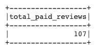
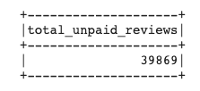
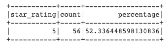
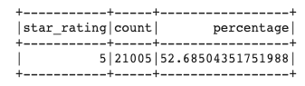
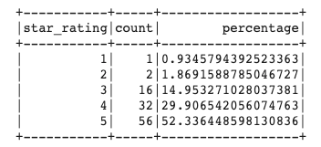
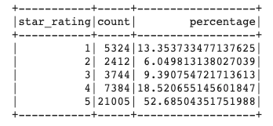

# Amazon_Vine_Analysis

## Overview of the analysis: Explain the purpose of this analysis.
The purpose of this project is to analyze the reviews of Amazon's Vine Program. This program is a paid program, where manufactuerers can pay to receive reviews from their products. Their products are provided to Amazon Vine members who are required to publish a review. One can only be a Vine Reviewer by invite only. Amazon considers Vine Reviewers some of the most trusted reviewers on their website. This project aims to determine if there is any bias toward favorable reviews from Vine members. 

## Results: Using bulleted lists and images of DataFrames as support, address the following questions:

### How many Vine reviews and non-Vine reviews were there?
There were a total of 43574 reviews for outdoor products. Of those 21372 reviews were 5 star ratings. Overall, there were far more reviews for paid vs. unpaid users. This makes sense because to become a Vine Reviewer, you must be selected. 

#### Total Count of Paid Reviews

#### Total Count of Unpaid Reviews

### How many Vine reviews were 5 stars? How many non-Vine reviews were 5 stars?
### What percentage of Vine reviews were 5 stars? What percentage of non-Vine reviews were 5 stars?

When considering the costs to have your company join the Amazon Vine Program, its important to know your reviewers aren't being swayed by receiving perks/payment from performing reviews. If this was the case for Vine Reviewers, we would possibily see a difference in 5-star reviews between paid and unpaid reviewers. However, through further review of the outdoor products reviews, there was not huge different between the porportion of 5 star reviews. 

#### Paid 5 Star Reviews

#### Unpaid 5 Star Reviews 

5 star reviews for both unpaid and paid reviewers accounted for about 52% of reviews. 

### Summary: In your summary, state if there is any positivity bias for reviews in the Vine program. Use the results of your analysis to support your statement. Then, provide one additional analysis that you could do with the dataset to support your statement.

5 Star reviews aren't the only useful metric to dive into. Other rated reviews can provide insight to whether or not there is a positivity bias among Vine Reviewers. 

#### All Star Reviews for Paid Reviewers

#### All Star Reviews for Unpaid Reviewers 

